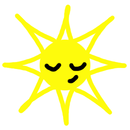

<a id="readme-top"></a>

<!-- PROJECT SHIELDS -->
<!--
*** I'm using markdown "reference style" links for readability.
*** Reference links are enclosed in brackets [ ] instead of parentheses ( ).
*** See the bottom of this document for the declaration of the reference variables
*** for contributors-url, forks-url, etc. This is an optional, concise syntax you may use.
*** https://www.markdownguide.org/basic-syntax/#reference-style-links
-->
[![Contributors][contributors-shield]][contributors-url]
[![Forks][forks-shield]][forks-url]
[![Stargazers][stars-shield]][stars-url]
[![Issues][issues-shield]][issues-url]

<!-- PROJECT LOGO -->
<br />
<div align="center">
  <a href="https://github.com/ravilkooo/">
    
  </a>

<h3 align="center">Sunshine Engine</h3>

  <p align="center">
    Game Engine
    <br />
    <a href="https://github.com/ravilkooo/SunshineEngine"><strong>Explore the docs »</strong></a>
    <br />
    <br />
    <a href="https://github.com/ravilkooo/">View Demo</a>
    &middot;
    <a href="https://github.com/ravilkooo/SunshineEngine/issues/new?labels=bug&template=bug-report---.md">Report Bug</a>
    &middot;
    <a href="https://github.com/ravilkooo/SunshineEngine/issues/new?labels=enhancement&template=feature-request---.md">Request Feature</a>
  </p>
</div>

<!-- TABLE OF CONTENTS -->
<details>
  <summary>Table of Contents</summary>
  <ol>
    <li>
      <a href="#about-the-project">About The Project</a>
      <ul>
        <li><a href="#built-with">Built With</a></li>
      </ul>
    </li>
    <li>
      <a href="#getting-started">Getting Started</a>
      <ul>
        <li><a href="#prerequisites">Prerequisites</a></li>
        <li><a href="#installation">Installation</a></li>
      </ul>
    </li>
    <li><a href="#usage">Usage</a></li>
    <li><a href="#roadmap">Roadmap</a></li>
    <li><a href="#contributing">Contributing</a></li>
    <li><a href="#license">License</a></li>
    <li><a href="#contact">Contact</a></li>
    <li><a href="#acknowledgments">Acknowledgments</a></li>
  </ol>
</details>


<!-- ABOUT THE PROJECT -->
## About The Project

<!-- [![Product Name Screen Shot][product-screenshot]](https://example.com) -->

<p align="right">(<a href="#readme-top">back to top</a>)</p>


### Built With

* C++
* DirectX 11

<p align="right">(<a href="#readme-top">back to top</a>)</p>

<!-- GETTING STARTED -->
## Getting Started


### Prerequisites

* CMake

### Installation

1. Clone the repo
   ```sh
   git clone https://github.com/ravilkooo/SunshineEngine.git
   ```
3. Configure projects using CMake
   ```sh
   mkdir build
   cd build
   cmake .. -G "Visual Studio 17 2022" -A x64
   ```
4. Open project `Sunshine.sln`
5. Build `ALL_BUILD`
6. '*Set as Startup Project*' on `SunshineEditor`
7. Run Editor

<p align="right">(<a href="#readme-top">back to top</a>)</p>


<!-- USAGE EXAMPLES -->
## Usage

<p align="right">(<a href="#readme-top">back to top</a>)</p>


<!-- ROADMAP -->
## Roadmap

- [x] Add Graphics module
- [ ] Add Physics and Collision module (Jolt)
- [ ] Add audio module (fmod)
- [ ] Lua integration
- [ ] World Editor

See the [open issues](https://github.com/ravilkooo/SunshineEngine/issues) for a full list of proposed features (and known issues).

<p align="right">(<a href="#readme-top">back to top</a>)</p>


<!-- CONTRIBUTING -->
## Contributing

If you have a suggestion that would make this better, please fork the repo and create a pull request. You can also simply open an issue with the tag "enhancement".
Don't forget to give the project a star! Thanks again!

1. Fork the Project
2. Create your Feature Branch (`git checkout -b feature/AmazingFeature`)
3. Commit your Changes (`git commit -m 'Add some AmazingFeature'`)
4. Push to the Branch (`git push origin feature/AmazingFeature`)
5. Open a Pull Request

<p align="right">(<a href="#readme-top">back to top</a>)</p>

### Top contributors:

<a href="https://github.com/ravilkooo/SunshineEngine/graphs/contributors">
  
</a>


<!-- LICENSE -->
## License


<p align="right">(<a href="#readme-top">back to top</a>)</p>

<!-- CONTACT -->
## Contact

Ravil - [@ravilkooo](https://t.me/ravilkooo) - ravilka.zftsh@yandex.ru

Project Link: [https://github.com/ravilkooo/SunshineEngine](https://github.com/ravilkooo/SunshineEngine)

<p align="right">(<a href="#readme-top">back to top</a>)</p>


<!-- ACKNOWLEDGMENTS -->
## Acknowledgments

<p align="right">(<a href="#readme-top">back to top</a>)</p>


<!-- MARKDOWN LINKS & IMAGES -->
<!-- https://www.markdownguide.org/basic-syntax/#reference-style-links -->
[contributors-shield]: https://img.shields.io/github/contributors/ravilkooo/SunshineEngine.svg?style=for-the-badge
[contributors-url]: https://github.com/ravilkooo/SunshineEngine/graphs/contributors
[forks-shield]: https://img.shields.io/github/forks/ravilkooo/SunshineEngine.svg?style=for-the-badge
[forks-url]: https://github.com/ravilkooo/SunshineEngine/network/members
[stars-shield]: https://img.shields.io/github/stars/ravilkooo/SunshineEngine.svg?style=for-the-badge
[stars-url]: https://github.com/ravilkooo/SunshineEngine/stargazers
[issues-shield]: https://img.shields.io/github/issues/ravilkooo/SunshineEngine.svg?style=for-the-badge
[issues-url]: https://github.com/ravilkooo/SunshineEngine/issues
[license-shield]: https://img.shields.io/github/license/ravilkooo/SunshineEngine.svg?style=for-the-badge
[license-url]: https://github.com/ravilkooo/SunshineEngine/blob/master/LICENSE.txt
[linkedin-shield]: https://img.shields.io/badge/-LinkedIn-black.svg?style=for-the-badge&logo=linkedin&colorB=555
[linkedin-url]: https://linkedin.com/in/linkedin_username
[product-screenshot]: logo/SunshineLogo.png
[Next.js]: https://img.shields.io/badge/next.js-000000?style=for-the-badge&logo=nextdotjs&logoColor=white
[Next-url]: https://nextjs.org/
[React.js]: https://img.shields.io/badge/React-20232A?style=for-the-badge&logo=react&logoColor=61DAFB
[React-url]: https://reactjs.org/
[Vue.js]: https://img.shields.io/badge/Vue.js-35495E?style=for-the-badge&logo=vuedotjs&logoColor=4FC08D
[Vue-url]: https://vuejs.org/
[Angular.io]: https://img.shields.io/badge/Angular-DD0031?style=for-the-badge&logo=angular&logoColor=white
[Angular-url]: https://angular.io/
[Svelte.dev]: https://img.shields.io/badge/Svelte-4A4A55?style=for-the-badge&logo=svelte&logoColor=FF3E00
[Svelte-url]: https://svelte.dev/
[Laravel.com]: https://img.shields.io/badge/Laravel-FF2D20?style=for-the-badge&logo=laravel&logoColor=white
[Laravel-url]: https://laravel.com
[Bootstrap.com]: https://img.shields.io/badge/Bootstrap-563D7C?style=for-the-badge&logo=bootstrap&logoColor=white
[Bootstrap-url]: https://getbootstrap.com
[JQuery.com]: https://img.shields.io/badge/jQuery-0769AD?style=for-the-badge&logo=jquery&logoColor=white
[JQuery-url]: https://jquery.com 